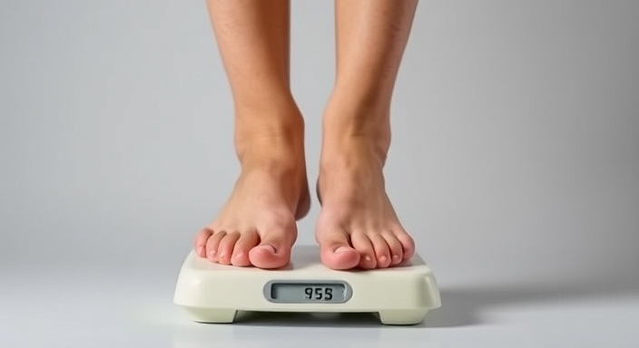

``` {r setup, include=FALSE}
knitr::opts_chunk$set(echo = TRUE)
```
   
$\\ \\ \\ \\$   
   
## Google Data Analytics Professional Certficate   
   
$\\ \\ \\ \\$   
   
   

$\\$      
   
##### Case Study 2: How Can a Wellness Technology Company Play It Smart?   
$\\ \\ \\ \\$  

#### Bellabeat, the company:-   
A pioneer in the fem-tech realm, Bellabeat is a women’s wellness
company that has helped millions of women track their cycle,
pregnancies, and live more in sync with their cycles.
[Bellabeat](https://bellabeat.com/)   
   
  
   
      
#### 1. Ask  

*What is the business task?*   
   
- Explore opportunities for growth.  
- Use trend of smart device usages data to give high-level recommendations.  
- Focus on Bellabeat products: Bellabeat app, Leaf, Time, Spring and Bellabeat Membership.

*Who are the stakeholders?*   

- The cofounder and Chief Creative Office Urška Sršen of the company Bellabeat:  
  - Sršen used her background as an artist to develop beautifully designed technology that informs and inspires women around the world.  
- Mathematician and Bellabeat’s cofounder Sando Mur: 
  - key member of the Bellabeat executive team
- Marketing Analytic Team:  
  - My fellow colleagues.
  - Compelling on figures and statistical concepts.  
$\\$   
   
- Conclusion: Need to generate an analytic report that explains the complex story at a simple level.   
$\\ \\$   
   
*What will be done in the following?*   
   
- Analyze smart device user data to search for trends and relationships and identify marketing schemes and also opportunities for company growth.      
$\\ \\$   
   
   
   
   
      
#### 2. Prepare  

*What data is to be analyzed?*
*Where is the data gathered?*
   
##### Data Source and storage
- Public Date Source: 
  - [Kaggle](https://www.kaggle.com/)   
  
- Creditability: License: 
  - [CC0: Public Domain](https://creativecommons.org/publicdomain/zero/1.0/)  
  
- Data integrity verification can be found on [FitBit Fitness Tracker Data](https://www.kaggle.com/datasets/arashnic/fitbit).  

- Data Storage: 
  - (Original)[Kaggle](https://www.kaggle.com/datasets/arashnic/fitbit) and, 
  - (My version) [GitHub](https://github.com/CharleyYeung/Data_Analysis)   
   
##### Sorting and Filtering:   
  - I will be focusing on daily data. So in the phases of Process and Analysis, I will try to perform a series of merging.   
   
   
*Possible issues with the data:*   
  - The dataset are not consistent. Some of them shows particular measures while some are merged with other.   
  - The data does not specify the gender and age of the users. Let's assume the data is unbiased.   
      
  
$\\ \\$   
   
   
#### 3. Process  

*Is the data ready to be analyzed?*
   
- I Will log as R_data_cleaning_R.rmd   
$\\$   

*Issues found in the datasets during data-cleaning:*   
   
- The dataset of dailyActivityMerged.csv of the March folder is valid.  
    - I find some users who do not use the device on some days.  I am not filtering them out for now as they may be my target. I will address it in the Share Phase. (## 1)     
    
    - The WeightLoginfo.csv has an issue: The number of active trackers is only 11 and 8 in March and April respectively (overlapping may occur), way less than the number in the master dataset. I will also leave it for later analysis (## 2).     
    
    - 24 out of 33 users track their sleeping time. This does not necessarily impose significant analytic problem but yet to discuss more in our share phase (## 3).   
    
    - Date format of the weightLogInfo_merged Table has to be fixed. I will do it in R environment.   
    
   
$\\ \\$   
   
   
   
      
#### 4. Analysis    
   
*A Quick Glimpse of the data*   
   
- Data Organization:   
  - I load the libraries and the datasets as below.   
  - The data is cleaned and will be rearranged as follows   
  
- Loading Essential Libraries:  
``` {r Loading_libraries, warning=FALSE}
library(tidyverse)
library(dplyr)
library(readr)
library(ggplot2)
```   

$\\ \\$


- Loading the Data:   
``` {r Loading_data, warning=FALSE}
combined_data <- read_csv("combined_data.csv")
combined_weight <- read_csv("combined_weight.csv")
april_daily_sleep <- read_csv("april_daily_sleep.csv")
master_and_sleep <- read_csv("master_and_sleep.csv")
```
   
- Now let's look at the aggregates of the cleaned datasets.   
``` {r Table_summaries, warning=FALSE}
summary(combined_data)
summary(april_daily_sleep)
summary(combined_weight)

combined_weight %>%
  group_by(Id) %>%
  summarize(Max_Weight = max(WeightKg, na.rm = TRUE),
            Min_Weight = min(WeightKg, na.rm = TRUE),
            Range_Weight = max(WeightKg, na.rm = TRUE) - min(WeightKg, na.rm = TRUE),
            Percentage_change_weight = (max(WeightKg, na.rm = TRUE) - min(WeightKg, na.rm = TRUE))/(Max_Weight = max(WeightKg, na.rm = TRUE)))*100

```
   
We found that:

##### Activities and Calories:   
- The **average** number of steps taken daily is only **7247**. Recent 20 years researches suggest **10,000** steps to keep an adult healthy. The average number is 27.16% less than the suggestion. Only around 25% of the records are above the suggested daily steps goal.   
- Calories burn per day is 2264 on average in the data. This aligns with the level suggested by the NHS of the UK, which is around 2200.
   
##### Sleep:   
- 7 hours of sleep for adults are recommended by most of the health studies. In the data, the participants have 419.5 minutes of sleeping time, just 0.5 minutes below the suggestion.  
- The **time in bed awake** (Some refer to sleep latency) sums up the time in bed minus the time asleep. The data's average is **39.17** minutes and the median is 25 mins. This is longer than the average of **20** minutes suggested by Sleep Foundation.   
   
##### Weight and BMI:   
- Out of 13 participants who recorded their weight, only 3 have their weight changed between 1% and 2% per month. Others do not have such significant change, implying room for improvement.   
- The **average BMI** of the data, which is **25.37**, slightly higher than the upper limit of healthy range recommended by WHO.   
   
   
*Relationships of the features*.   
   
##### How activities and calories burn relate?   
   
``` {r Visualization_1, warning=FALSE}
ggplot(data=master_and_sleep, aes(x=TotalSteps, y=Calories)) + 
  geom_point(color="darkblue") + geom_smooth(color="orange") + labs(title="Total Steps vs. Calories")
```
      
The graph illustrates the relationship between the total steps and calories. It aligns with common sense that the **more the steps** a participant take, **the more the calories** it burns. 
   
##### Does activity relate to sleep time?         
   
``` {r Visualization_2, warning=FALSE}
ggplot(data=master_and_sleep, aes(x=TotalSteps, y=TotalMinutesAsleep)) + 
geom_point(color="darkviolet") + geom_smooth(color='yellow') +
  labs(title="Total Steps vs. Total Minutes Asleep")
```
   
   
The relation does not look too obvious. But we can have a closer look of the quality of sleep.   
   
##### Any relation between steps and time in bed awake?      
   
```{r Visualization_3, warning=FALSE}
ggplot(data=master_and_sleep, aes(x=TotalSteps, y=TimeInBedAwake)) + 
geom_point(color="green") + geom_smooth(color='blue') +
  labs(title="Sleep Latency VS Total Steps")
```
   
Although the smooth line looks horizontal, meaning that overall the steps do not really have relation with sleep latency, we can see that **below 13,000 steps**, the **sleep latency varies** quite a lot. **Beyond that hurdle**, the sleep latency tends to zero. And the **smooth line** has a **relatively negative slope**. This may imply that the **more steps** a participant takes (over 13,000), the **faster** it takes to **get asleep**. It is a sign of **better quality of sleep**.  

##### What about Calories and Quality of sleep?   
   
```{r Visualization_4, warning=FALSE}
ggplot(data=master_and_sleep, aes(x=Calories, y=TimeInBedAwake)) + 
geom_point(color="brown") + geom_smooth(color='white') +
  labs(title="Sleep Latency VS Calories")
```
   
It might be interesting that while calories burn level is around 1500, the sleep latency varies quite a lot, where observations lie from 100 to over 350. The potential explanation is that **1500 calories** is the average energy burn for a person.  Hence, we can regard this as the **starting point** of this analysis and **re-run** the graph again.   
   
``` {r Visualization_5, warning=FALSE}
ggplot(data = subset(master_and_sleep, Calories > 1300), 
       aes(x = Calories, y = TimeInBedAwake)) + 
  geom_point(color = "brown") + 
  geom_smooth(color = 'white') +
  labs(title = "Sleep Latency VS Calories (Filtered for Calories > 1300)")
```
   
   
In the "Sleep Latency VS Calories burn" graph, we can see that along with the Calories burn increase, the sleep latency tends to stick to low level.      
   
``` {r Visualization_6, warning=FALSE}
ggplot(data=master_and_sleep, aes(x=SedentaryMinutes, y=TotalMinutesAsleep)) + 
geom_point(color='darkblue') + geom_smooth() +
  labs(title="Total Sleep Time VS Sedentary Minutes")
```
   
The graph shows a positive then rather strongly negative relation between sedentary time and sleep time. When **sedendary time** is less than **500 minutes**, the **sleep time** can **increase** along with sedentary. However, **beyond 500 minutes** of sedentary time, the **sleep time** more apparently **shrinks** as the sedentary time increases. Thus we can also observe that the overall **sleep time peak** can be found while **sedentary time** is between **500 to 800** minutes per day.

$\\ \\$   
   
   
      
   
#### 5. Share  
   
In conclusion, I would recommend 4 directions of wellness by using Bellabeat products.   
   
- Increase the **incentive for taking more steps** (Leaf or Time).  
- Put more focus on **sedentary time** (Time and App).   
- Introduce **calories intake record** to keep track (App).   
- Kick start a **quality of sleep program** (Time and App).   

*Marketing recommendations:*   
   
- Target customers: exploring the **market of social media**. As the company has been putting advertisement efforts on the social media platforms, I suggest the company gaining more exposure with regard of promoting engagement of **peer group users** who have been working well on these platforms, ie collaboration with content creators.   
- Equipping the existing product with new features:   
  - App: 1. Invite the **famous content creators or celebs** to record **Voice Over**. and play when the users start the **steps tracking** feature.   
         2. Integrate the **competition within peer group users** on **daily steps** taken. Ranking features can be introduced and **product discounts** as prizes may employ.  
         3. Implement a **tracking program of quality of sleep**, which functions as a **alarm of calm-down period** to promote the balance of activity and sedentary for sleeping quality enhancement.   
         4. Introduce a **calories intake calculation** and also **meal planning** and record to keep track on the food health. This can also complement the **peer group competition** feature.   
  - Leaf: Act as a support of the app in regard of the steps recording feature.   
  - Time: Act as a support of the app in regard of the sleeping quality record feature.   
- Promotions:
  - Celeb Branding: invite **celebrities in sports** or **social media content creators** to promote the new features.
     
*Limitations, Issues and Opportunities:*   
     
- (## 1) For those users who do not use their device: the marketing team can consider lure them to reactivate the device by schemes like peer group or auto-matching competition with incentive prizes.   
    
- (## 2) Although we have looked into how the weight of the participants changed over the period, the number of participants who used weight tracking is not sufficient for drawing effective conclusions in terms of representing the whole population. For more representative calculations, we can consider a broader data source or longer period. It is also worthy to point out that marketing team can attract the users to track their weight with including the tracking as a part of the competition.     
   
- (## 3) More than 2/3 of the participants used the sleep time tracking. This sounds promising for the sake of marketing scheme. The marketing team should not neglect this pattern and should design campaigns of making use of it to promote quality of sleep.   
    
#### Thank you very much for your reading. Hope you enjoy it!
  
$\\ \\ \\$    
  
Special thanks to:  
[](https://www.coursera.org/professional-certificates/google-data-analytics)&nbsp;&nbsp;&nbsp;&nbsp;&nbsp;&nbsp;[](https://www.kaggle.com/)&nbsp;&nbsp;&nbsp;&nbsp;&nbsp;&nbsp;[](https://bellabeat.com/)